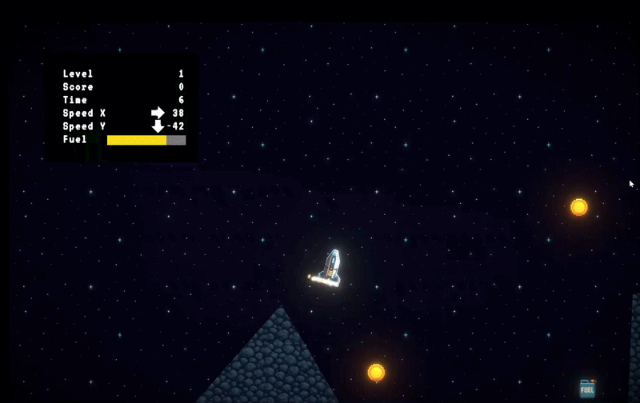

# Lua Lander Clone

A physics-based 2D lunar landing game built with Unity and C#. Pilot a spacecraft through hazardous terrain, manage fuel, collect coins, and land safely to earn the highest score.

<p align="center">
  
</p>

## Features

- Physics-based spacecraft movement using `Rigidbody2D`
- Fuel management and collectible coins
- Landing validation based on impact speed and spacecraft orientation
- Score calculation with landing-pad multipliers
- Multiple levels with retry and progression flows
- Main menu, instructions, HUD, pause menu, landing results, and game-over screens
- Thruster and explosion particle effects with audio feedback

## Technical Highlights

- Used C# events to separate gameplay, UI, audio, and VFX responsibilities
- Implemented an enum-based finite state machine for waiting, active gameplay, and game-over states
- Applied force, torque, and gravity through Unity's 2D physics system
- Evaluated landings using collision-relative velocity and vector dot products
- Built responsive UI workflows with UGUI and TextMeshPro

## Controls

| Input | Action |
| --- | --- |
| `Up Arrow` | Apply thrust |
| `Left Arrow` | Rotate left |
| `Right Arrow` | Rotate right |
| `Esc` | Pause or resume |

## Built With

- Unity `6000.1.12f1`
- C#
- Rigidbody2D / Unity Physics 2D
- Universal Render Pipeline (2D)
- UGUI and TextMeshPro
- Unity Input System
- Cinemachine
- Particle System and AudioSource

## Getting Started

1. Clone the repository:

   ```bash
   git clone https://github.com/Kuro1726/LuaLander.git
   ```

2. Open the project with Unity Hub using Unity `6000.1.12f1` or a compatible Unity 6 version.
3. Open `Assets/Scenes/MainMenuScene.unity`.
4. Enter Play Mode.

## Project Structure

```text
Assets/
├── Prefabs/          # Levels, landing pads, pickups, VFX, and audio prefabs
├── Scenes/           # Main menu, gameplay, and game-over scenes
└── Scripts/
    ├── Pickup/       # Coin and fuel pickup behaviours
    ├── UI/           # HUD, menus, pause, results, and game-over UI
    ├── Lander.cs     # Flight physics, fuel, collision, and landing logic
    └── GameManager.cs
```

## Author

Developed by [Kuro1726](https://github.com/Kuro1726) as a personal Unity game development project.
